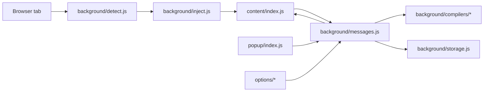
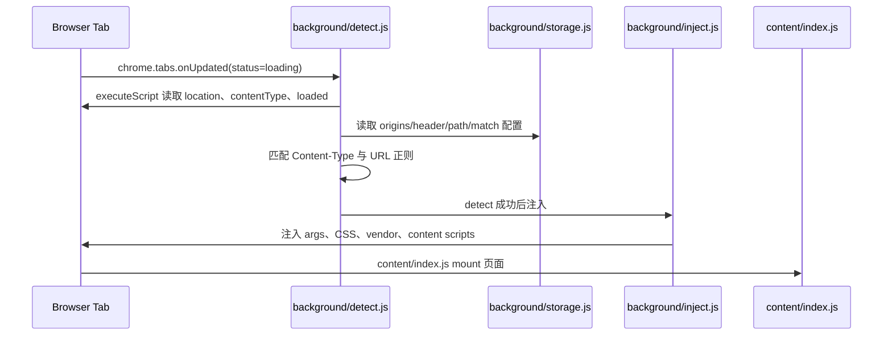
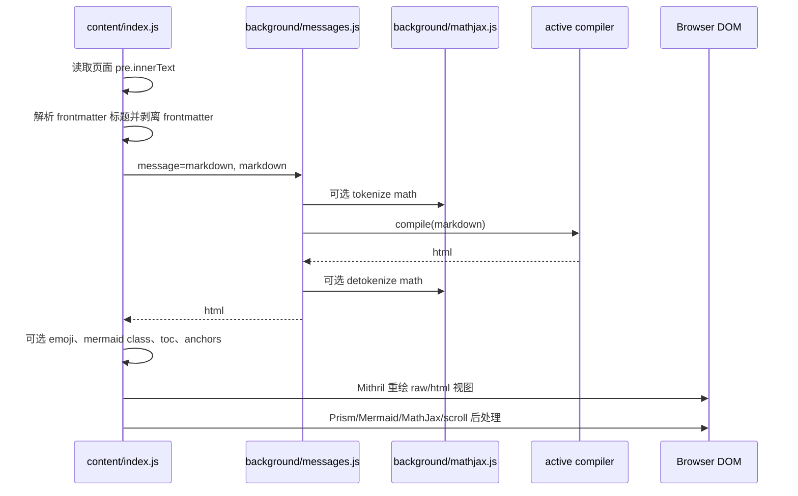
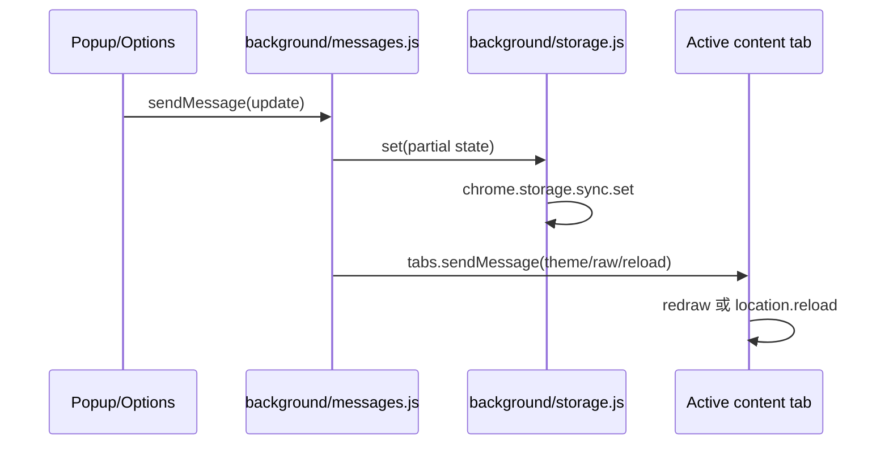
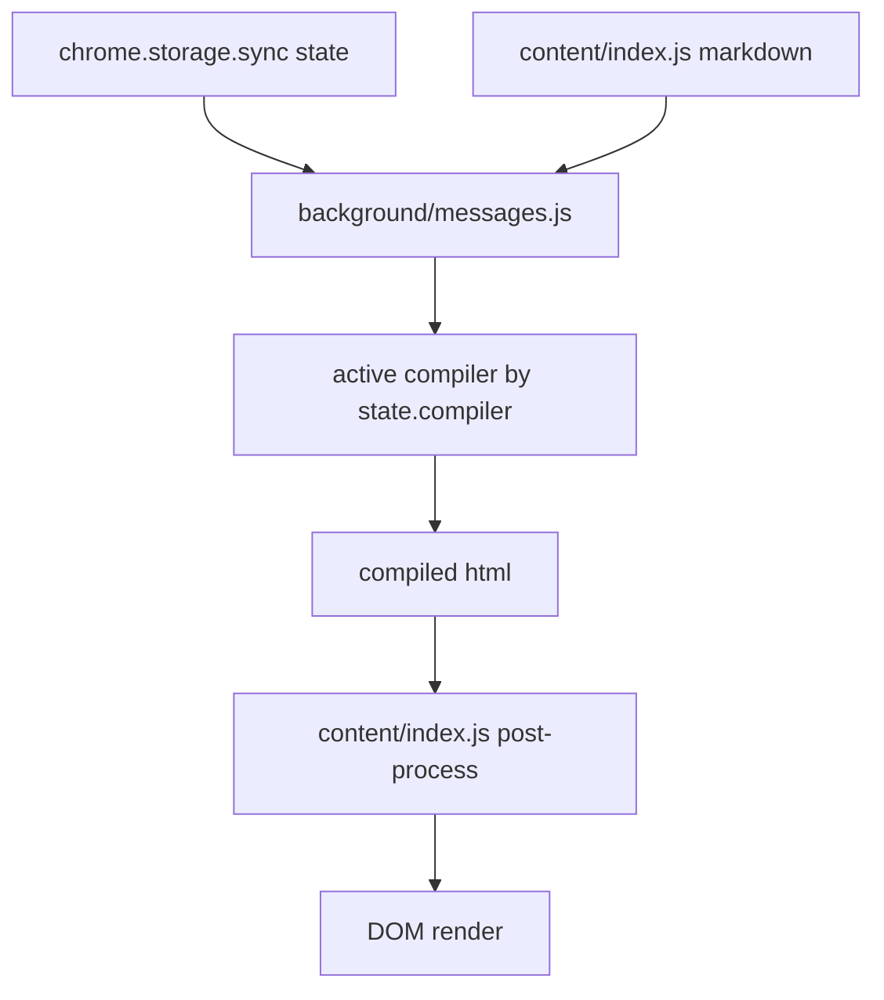
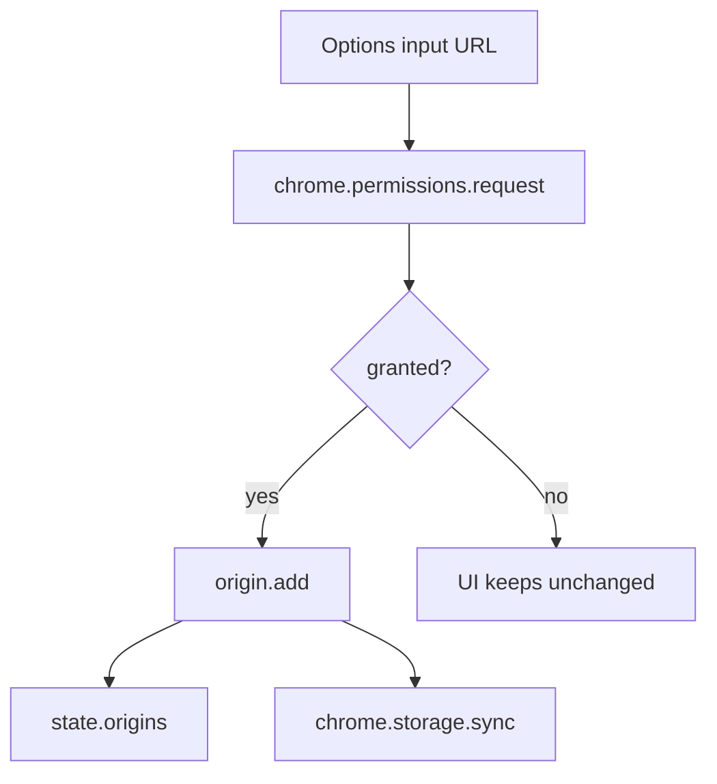

# Markdown Viewer 架构文档与模块设计

本文基于当前仓库源码梳理，描述 Markdown Viewer 浏览器扩展的现有架构、模块边界、核心流程和可演进方向。

## 1. 项目定位

Markdown Viewer 是一个原生 WebExtension 浏览器扩展，用于在浏览器中识别本地或远程 Markdown 文档，并将浏览器默认展示的纯文本内容转换成带主题、目录、语法高亮、MathJax、Mermaid、Emoji、自动刷新等能力的阅读页面。

项目没有根目录级 `package.json`，运行时代码是原生 JavaScript + WebExtension API。`build/` 下的脚本负责构建 `vendor/` 和 `themes/` 目录并打包扩展。

## 2. 顶层架构



系统由五类模块组成：

| 层级 | 目录/文件 | 职责 |
| --- | --- | --- |
| 扩展入口 | `manifest.chrome.json`, `manifest.firefox.json`, `background/index.js` | 声明扩展权限、后台入口、弹窗、选项页；初始化后台服务模块 |
| 后台服务 | `background/*.js`, `background/compilers/*.js` | 检测 Markdown 页面、注入内容脚本、维护配置、处理消息、编译 Markdown、管理图标和可选权限 |
| 内容渲染 | `content/*.js`, `content/*.css` | 接管页面 DOM，将原始 Markdown 渲染成 HTML 或原文视图，处理主题、目录、滚动、自动刷新和增强渲染 |
| 用户界面 | `popup/*`, `options/*` | 弹窗快速设置、选项页高级配置、站点授权、自定义主题和外观设置 |
| 构建产物 | `build/*`, 生成的 `vendor/`, `themes/` | 下载/打包第三方库、主题文件，生成浏览器可安装包 |

## 3. 运行时生命周期

### 3.1 扩展启动

1. 浏览器加载扩展 manifest。
2. Chrome 使用 `background/index.js` 作为 MV3 service worker。
3. Firefox manifest 直接声明后台脚本列表，同时也加载 `background/index.js`。
4. `background/index.js` 通过 `importScripts` 加载 vendor 编译器、后台模块和编译器适配器。
5. 后台入口初始化以下服务：
   - `storage`: 同步存储、默认配置、迁移逻辑
   - `inject`: 页面脚本/CSS 注入
   - `detect`: Markdown 页面检测
   - `webrequest`: 自动刷新相关的可选 `webRequest` 监听
   - `mathjax`: 编译前后的公式占位保护
   - `xhr`: 后台拉取文件内容
   - `icon`: 扩展图标更新
   - `messages`: 统一消息路由

### 3.2 页面检测与注入



检测逻辑基于两组条件：

- 来源权限和来源配置：`state.origins`
- 文档识别规则：`Content-Type` 为 `text/markdown`、`text/x-markdown`、`text/plain`，或 URL 满足配置的正则表达式

`file://` 默认在配置中存在，但实际可访问性还依赖浏览器扩展管理页中的文件访问开关。

### 3.3 Markdown 渲染



当前 Markdown 编译发生在后台服务中，内容脚本只负责 DOM、主题和后处理。这一设计让编译器和第三方解析库集中在后台侧，页面侧只拿最终 HTML。

## 4. 核心模块设计

### 4.1 Manifest 与入口

| 文件 | 设计说明 |
| --- | --- |
| `manifest.chrome.json` | Chrome MV3 配置，使用 `service_worker`，声明 `storage`、`scripting`、`file:///*`，并把站点权限和 `webRequest` 作为可选权限 |
| `manifest.firefox.json` | Firefox 配置，后台脚本显式列出 vendor、编译器和后台模块；可选权限中包含 `webRequest` 与远程来源 |
| `background/index.js` | 后台组合根，按依赖顺序加载脚本，实例化服务，注册 `tabs.onUpdated` 和 `runtime.onMessage` |

入口采用全局命名空间 `md` 组装模块，各文件通过向 `md` 挂载工厂函数实现弱模块化。优点是没有构建器时也容易运行；代价是依赖顺序强、全局变量约束多。

### 4.2 存储模块

文件：`background/storage.js`

职责：

- 定义默认配置：
  - 当前主题、编译器、raw/html 视图状态
  - 内容功能开关
  - origins 规则
  - 图标和 UI 主题
  - 自定义主题
  - 各编译器默认选项
- 从 `chrome.storage.sync` 加载持久化配置。
- 将旧版本配置迁移到当前结构。
- 提供 `state` 和 `set(options)` 给其他后台模块使用。
- 清理与配置不一致的浏览器 host permissions。

核心数据模型：

```js
{
  theme: "github",
  compiler: "markdown-it",
  raw: false,
  match: "\\.(?:markdown|mdown|mkdn|md|mkd|mdwn|mdtxt|mdtext|text)(?:#.*|\\?.*)?$",
  themes: { width: "auto" },
  content: {
    autoreload: false,
    emoji: false,
    mathjax: false,
    mermaid: false,
    syntax: true,
    toc: false
  },
  origins: {
    "file://": {
      header: true,
      path: true,
      match: "..."
    }
  },
  settings: {
    icon: "default",
    theme: "light"
  },
  custom: {
    theme: "",
    color: "auto"
  },
  "markdown-it": {},
  marked: {},
  remark: {}
}
```

设计注意点：

- `state` 是后台内存中的单例状态，`set` 同时写入 `chrome.storage.sync`。
- 迁移逻辑会原地修改 `state`，适合当前轻量架构，但后续新增配置时应保持迁移幂等。
- 自定义主题写入 sync storage，受浏览器单项配额限制，当前通过错误信息限制约 8KB。

### 4.3 检测模块

文件：`background/detect.js`

职责：

- 监听 tab 加载状态。
- 在页面加载时读取页面 URL、`document.contentType` 和是否已注入。
- 根据 `state.origins` 中的 origin、通配 origin、header/path 开关和 URL 正则判断是否应渲染。
- 在 Firefox 场景下通过 `ping` 避免重复注入。

origin 匹配顺序大致为：

1. 精确 `location.origin`
2. 协议 + hostname/host
3. 协议 + 通配子域
4. 任意协议 + hostname/host
5. 任意协议 + 通配子域
6. `*://*`

检测成功后调用 `inject(tabId)`。

### 4.4 注入模块

文件：`background/inject.js`

职责：

- 把当前配置作为 `args` 注入目标页面。
- 插入内容 CSS：`content/index.css`、`content/themes.css`。
- 按功能开关注入运行时依赖：
  - 基础渲染：`mithril.min.js`、`content/index.js`、`content/scroll.js`
  - 语法高亮：`prism.min.js`、`prism-autoloader.min.js`、`content/prism.js`
  - Emoji：`content/emoji.js`
  - Mermaid：`mermaid.min.js`、`panzoom.min.js`、`content/mermaid.js`
  - MathJax：`content/mathjax.js`、`tex-mml-chtml.js`
  - 自动刷新：`content/autoreload.js`

该模块是后台与页面的边界。它不做渲染，只负责把渲染所需的配置和脚本放进目标页面。

### 4.5 消息总线

文件：`background/messages.js`

职责：

- 作为所有 `chrome.runtime.sendMessage` 请求的集中路由。
- 面向内容脚本提供：
  - `markdown`: 编译 Markdown 并返回 HTML
  - `autoreload`: 后台拉取文件内容
  - `prism`: 注入特定语言的 Prism 语法包
  - `mathjax`: 注入 MathJax TeX 扩展
- 面向 popup 提供：
  - 获取当前设置
  - 修改主题、宽度、raw/html、编译器、内容开关
  - 恢复默认设置
  - 打开高级选项页
- 面向 options 提供：
  - origins 查询、增加、删除、更新
  - settings 查询、图标/UI 主题更新
  - custom theme 查询与保存

消息协议：

| 消息 | 发起方 | 处理方 | 结果 |
| --- | --- | --- | --- |
| `markdown` | content | background | 返回 `{ message: "html", html }` |
| `autoreload` | content/background webrequest | background/content | 拉取内容或停止轮询 |
| `prism` | content | background | 动态注入 Prism 语言文件 |
| `mathjax` | content | background | 动态注入 MathJax 扩展 |
| `popup` | popup | background | 返回 popup 所需状态 |
| `popup.theme` | popup | background/content | 保存主题并通知内容页重绘 |
| `popup.raw` | popup | background/content | 保存 raw 状态并通知内容页重绘 |
| `popup.themes` | popup | background/content | 保存宽度配置并通知内容页重绘 |
| `popup.defaults` | popup | background/content | 重置设置并通知内容页刷新 |
| `popup.compiler.name` | popup | background/content | 切换编译器并刷新 |
| `popup.compiler.options` | popup | background/content | 保存编译器选项并刷新 |
| `popup.content` | popup | background/content | 保存内容功能开关、刷新并更新 webRequest |
| `options.origins` | options | background | 返回来源规则和默认 match |
| `origin.add/remove/update` | options | background | 修改来源规则并同步权限相关状态 |
| `options.settings` | options | background | 返回图标和 UI 主题 |
| `options.icon` | options | background | 保存设置并刷新扩展图标 |
| `options.theme` | options | background | 保存 options/popup UI 主题 |
| `custom.get/set` | options | background | 读取或保存自定义 CSS |

### 4.6 编译器适配层

目录：`background/compilers/`

当前入口实际加载：

- `markdown-it.js`
- `marked.js`
- `remark.js`

保留但未被当前 manifest/entry 加载：

- `commonmark.js`
- `remarkable.js`
- `showdown.js`

每个编译器适配器遵循相同形态：

```js
md.compilers[name] = (() => {
  var defaults = {}
  var description = {}
  var ctor = ({storage: {state}}) => ({
    defaults,
    description,
    compile: (markdown) => "html"
  })
  return Object.assign(ctor, {defaults, description})
})()
```

设计收益：

- popup 可以按统一模型渲染编译器选项。
- storage 可以自动把编译器默认配置合并进全局 defaults。
- messages 可以通过 `state.compiler` 动态选择编译器。

新增编译器时应完成：

1. 添加 `background/compilers/<name>.js`。
2. 在 Chrome 的 `background/index.js` 和 Firefox manifest 的后台脚本列表中加载依赖与适配器。
3. 在 `build/` 中加入 vendor 构建脚本，或保证运行时依赖已存在于 `vendor/`。
4. 确认 `defaults` 中的布尔项能在 popup/options 中正确展示。

### 4.7 内容渲染模块

文件：`content/index.js`

职责：

- 从注入的 `args` 初始化页面状态。
- 接管默认 Markdown 文本页面的 `<pre>`。
- 读取 Markdown 原文，处理 frontmatter 标题。
- 请求后台编译 Markdown。
- 根据设置切换 HTML 渲染或 raw Markdown 渲染。
- 加载主题 CSS、Prism CSS、自定义 CSS。
- 生成 ToC、标题 anchor、favicon。
- 对后台通知做增量响应：
  - `reload`
  - `theme`
  - `themes`
  - `raw`
  - `autoreload`

内容渲染使用 Mithril 直接 mount 到 `body`。HTML 输出通过 `m.trust(state.html)` 插入，因此安全边界主要依赖：

- 用户授予的站点权限
- Markdown 编译器的 HTML/sanitize 选项
- 浏览器扩展环境的 CSP 和页面隔离行为

### 4.8 内容增强模块

| 文件 | 职责 |
| --- | --- |
| `content/prism.js` | 改写 Prism autoloader，让语言包通过后台 `chrome.scripting.executeScript` 注入 |
| `content/mermaid.js` | 渲染 `mermaid`/`mmd` 代码块，支持主题切换后重渲染，并使用 Panzoom 实现缩放和平移 |
| `content/mathjax.js` | 配置 MathJax v3，使用后台消息按需加载 TeX 扩展，设置字体资源路径 |
| `content/emoji.js` | 将 `:shortname:` 转换为 EmojiOne 图片 |
| `content/scroll.js` | 等待样式、图片、代码高亮、Mermaid、MathJax 完成后恢复滚动位置，并持久化文档和 ToC 滚动 |
| `content/autoreload.js` | 定时拉取当前文档，内容变化时触发重新渲染 |

### 4.9 Popup 模块

文件：`popup/index.html`, `popup/index.js`, `popup/index.css`

职责：

- 提供快速设置入口：
  - raw/html 切换
  - 恢复默认值
  - 内容主题与宽度
  - 编译器与编译器选项
  - 内容增强开关
  - 打开高级选项页
- 使用 Mithril 渲染 UI，使用 Material Components 的 ripple、tabs、switch 控件。
- 复用同一个 `Popup()` 工厂：在 popup 页面渲染紧凑视图，在 options 页面通过 `popup.options()` 渲染设置面板。

### 4.10 Options 模块

目录：`options/`

| 文件 | 职责 |
| --- | --- |
| `options/index.html` | 选项页 shell，加载 Bootstrap、MDC、Mithril、CSSO 和本地脚本 |
| `options/index.js` | 挂载 origins 与 settings 视图，处理顶部导航 |
| `options/origins.js` | 管理文件访问提示、站点授权、origin 规则、header/path 开关和 URL 正则 |
| `options/settings.js` | 管理扩展图标和 popup/options UI 主题 |
| `options/custom.js` | 上传、压缩、保存、删除自定义 CSS 主题，并配置其色彩模式 |

Options 页是权限和高级配置的主要入口。它同时维护浏览器的 host permissions 和扩展内部的 `state.origins`。

### 4.11 自动刷新模块

涉及文件：

- `background/webrequest.js`
- `background/xhr.js`
- `content/autoreload.js`

设计：

- 当 `content.autoreload` 开启时，内容脚本每秒拉取当前 URL。
- 对 `file://` 使用后台 `fetch`，因为内容脚本直接请求文件受限。
- 对非 file URL，内容脚本直接使用 `XMLHttpRequest`。
- `webrequest` 可选权限用于检测非 localhost 的完成请求，并向内容脚本发送 `autoreload` 消息以停止轮询。

README 中说明自动刷新主要面向：

- `file:///`
- 解析到 `127.0.0.1` 或 `::1` 的本地服务

## 5. 数据流与状态流

### 5.1 配置更新流



### 5.2 编译状态流



### 5.3 权限状态流



## 6. 构建与发布设计

构建入口：`build/package.sh`

构建过程：

1. 清理旧的 `themes/`、`vendor/`、`markdown-viewer.zip`。
2. 创建目标目录。
3. 依次运行各依赖的构建脚本：
   - Bootstrap
   - CSSO
   - markdown-it
   - marked
   - MathJax
   - MDC
   - Mermaid
   - Mithril
   - Panzoom
   - Prism
   - Remark
   - themes
4. 复制源码目录、生成的 `themes/`、`vendor/`、LICENSE 到临时包目录。
5. 根据目标浏览器复制对应 manifest 为 `manifest.json`。
6. 生成 `markdown-viewer.zip`。

注意：

- 当前仓库没有提交 `vendor/` 和 `themes/`，本地开发或打包前必须运行构建脚本。
- Chrome 打包 zip 包含顶层 `markdown-viewer/` 目录；Firefox 打包 zip 包含目录内容本身。

## 7. 模块间接口约定

### 7.1 后台模块工厂约定

后台模块通过全局 `md` 命名空间注册工厂：

```js
md.moduleName = (deps) => {
  return api
}
```

`background/index.js` 是唯一组合根，负责显式注入依赖。

### 7.2 编译器适配器约定

编译器必须暴露：

- `defaults`: 可持久化的默认配置
- `description`: 给 popup/options 展示的配置说明
- `compile(markdown)`: 同步返回 HTML 字符串

当前消息总线默认同步调用 `compile`，所以新增编译器若需要异步处理，必须先调整 `messages.markdown` 的协议。

### 7.3 内容脚本状态约定

`content/index.js` 依赖注入时创建的全局 `args`，字段包括：

- `theme`
- `raw`
- `themes`
- `content`
- `compiler`
- `custom`
- `icon`

新增内容功能时，需要同时修改：

1. `storage.defaults().content`
2. `inject.js` 的脚本注入列表
3. `messages.js` 中的必要消息处理
4. `popup/index.js` 的描述文本
5. `content/index.js` 或新增内容脚本

## 8. 质量与风险观察

| 类型 | 观察 | 影响 | 建议 |
| --- | --- | --- | --- |
| 构建可复现性 | 根目录没有统一包管理入口，依赖散落在 `build/*/package.json` | 新贡献者不易知道如何开发和验证 | 增加根级开发说明或轻量 `Makefile`/npm script |
| 全局变量 | 模块依赖 `md`、`args`、`state` 等全局对象 | 文件加载顺序和命名冲突风险较高 | 后续可逐步收敛为显式模块或增加命名空间注释 |
| 正则输入 | origin 的 path match 来自用户输入，并在检测时直接 `new RegExp` | 无效正则可能打断检测流程 | 在 options 保存前校验，detect 中兜底 try/catch |
| HTML 信任边界 | 默认允许 Markdown 中的 HTML，并通过 `m.trust` 写入 DOM | 适合本工具定位，但需要清晰告知风险 | README/选项说明中强调信任来源和 sanitize 选项 |
| 远程图片 | Emoji 功能使用 jsDelivr EmojiOne 图片 | 可能引入远程资源请求和隐私/离线问题 | 可考虑将 emoji 资源本地化或加说明 |
| 旧适配器 | `commonmark`、`remarkable`、`showdown` 适配器存在但未加载 | 维护者可能误以为仍可用 | 标注 legacy，或恢复构建/入口加载 |
| 测试缺口 | 未发现自动化测试入口 | 修改检测、注入、消息协议时回归成本高 | 增加最小单元测试和浏览器扩展冒烟测试清单 |

## 9. 推荐的演进路线

### 短期

- 为 `origin.match` 增加正则校验和错误提示。
- 补充根目录开发说明：如何构建 `vendor/`、`themes/`，如何加载 Chrome/Firefox 扩展。
- 在文档中明确当前实际支持的编译器列表，避免 legacy 适配器误导。
- 给 `messages.js` 的消息协议增加注释或拆分 handler map，降低长 if/else 的维护成本。

### 中期

- 将后台消息处理拆成 `contentHandlers`、`popupHandlers`、`optionsHandlers`。
- 为 `detect` 的 origin 匹配逻辑编写纯函数测试。
- 为 storage migration 建立版本化迁移测试，避免后续升级破坏旧用户配置。
- 增加浏览器扩展冒烟测试脚本，覆盖文件 URL、远程 URL、主题切换、raw/html、目录、自动刷新。

### 长期

- 引入轻量构建工具或统一包管理入口，把 vendor 构建和发布流程收束到根目录命令。
- 将内容渲染 pipeline 明确拆成 `read -> compile -> postProcess -> render -> enhance`。
- 考虑支持异步编译器协议，为更复杂的 Markdown 处理或 worker 化留下空间。
- 将安全策略作为一等配置，提供更明确的 HTML sanitize 模式。

## 10. 开发者改动指南

### 新增内容功能

1. 在 `background/storage.js` 的 `content` 默认配置中新增开关。
2. 在 `popup/index.js` 的 `description.content` 中新增说明。
3. 在 `background/inject.js` 中按开关注入所需脚本/CSS。
4. 如需后台能力，在 `background/messages.js` 中新增消息。
5. 在 `content/` 中实现页面侧逻辑。
6. 检查 raw/html 视图、主题切换、自动刷新和滚动恢复是否受影响。

### 新增主题

1. 在主题构建脚本中引入主题来源。
2. 确保生成到 `themes/<name>.css`。
3. 在 `content/index.js` 的 `_themes` 中标注 `light`、`dark` 或 `auto`。
4. 在 `popup/index.js` 的 `_themes` 列表中加入主题名。
5. 运行打包流程并在 Chrome/Firefox 中验证。

### 新增 Markdown 编译器

1. 添加编译器 vendor 构建。
2. 添加 `background/compilers/<name>.js` 适配器。
3. 修改 Chrome/Firefox 入口脚本加载顺序。
4. 确认 `defaults`、`description`、`compile` 符合统一接口。
5. 验证 popup 选项、storage sync、HTML 输出、标题 anchor、ToC。
